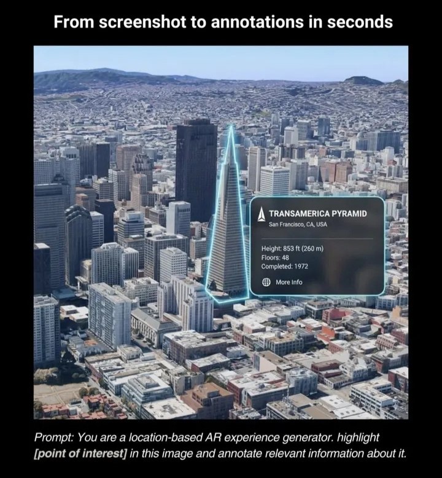
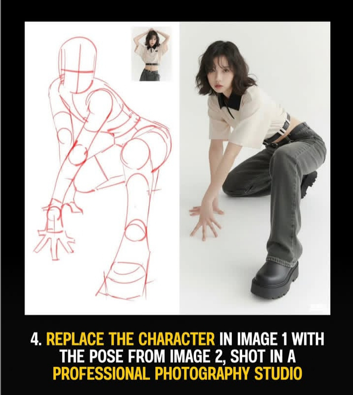
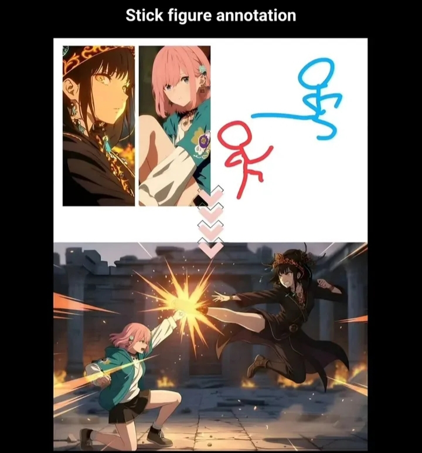
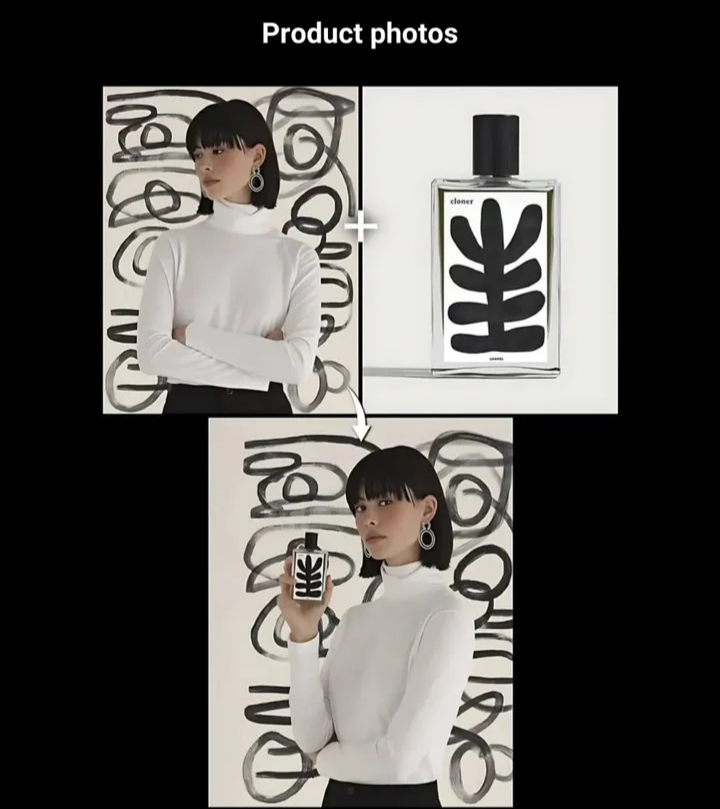

K2 Think

Prompt 1
Create a 1/7 scale commercialized figurine of the characters in the picture, in a realistic style, in a real environment. The figurine is placed on a computer desk. The figurine has a round transparent acrylic base, with no text on the base. The content on the computer screen is the ZBrush modeling process of this figurine. Next to the computer screen is a BANDAI-style toy packaging box printed with the original artwork. The packaging features two-dimensional flat illustrations.
The figurine is highly detailed, capturing the intricate features of the characters, including their clothing, facial expressions, and accessories. The colors are vibrant and true to the original design, with careful attention to shading and highlights to enhance the realism. The acrylic base is polished and clear, providing a sturdy support for the figurine while allowing light to pass through, creating a visually appealing effect.

Cases
Blended a cartoon girl into real life, combining animations by nano banana and vio3.
Image restoration
Enhance it, increase contrast boost colouring, make it richer
Put this shirt on him
Make the character more lively, add more details to the face, make it more three-dimensional

Prompt 2
You are a location-based AR experience generator. Highlight [point of interest] in this image and annotate relevant information about it.
Use the following format:
[point of interest]: [description]
[location]: [latitude, longitude]
[image URL]: [image URL]
[additional notes]: [any additional notes or context about the point of interest]
[point of interest]: The Great Wall of China
[description]: A historic fortification stretching over 13,000 miles, built to protect against invasions and raids.
[location]: 40.4319° N, 116.5704° E
[image URL]: https://example.com/great_wall.jpg
[additional notes]: The Great Wall is a UNESCO World Heritage site and one of the most iconic landmarks in China, attracting millions of tourists each year.

Prompt 3
You are a prompt engineer. Given the following user request, generate a detailed and specific prompt for an AI image generation model to create an image that meets the user's needs.
User request
Create a futuristic cityscape at sunset with flying cars and neon lights.
Generated prompt
A sprawling futuristic cityscape at sunset, featuring towering skyscrapers adorned with vibrant neon lights in various colors. The sky is a gradient of warm hues, transitioning from deep orange to soft pink and purple. Flying cars of sleek, aerodynamic designs zip through the air, leaving trails of light behind them. The streets below are bustling with activity, showcasing a blend of advanced technology and urban life. Reflections of the neon lights shimmer on the glass surfaces of the buildings, creating a dynamic and lively atmosphere. The overall scene should evoke a sense of wonder and excitement about the future.

Prompt 4
Make me look like i am in 1900s in subcontenent. Change my fashion, hairstyle and background.

Or

You are a prompt engineer. Given the following user request, generate a detailed and specific prompt for an AI image generation model to create an image that meets the user's needs.
User request
Make me look like I am in 1900s in subcontinent. Change my fashion, hairstyle and background.
Generated prompt  
A portrait of a person styled to resemble the 1920s in the Indian subcontinent. The individual is dressed in traditional attire from that era, such as a kurta or

Prompt 5
A megical library at night, with glowing books flying off the shelves, enchanted lanterns floating, and a spiral staircase leading into the stars - fantasy concept art.

Prompt 6
A serene forest glade bathed in the soft light of dawn, with ethereal creatures like fairies and unicorns gently interacting with the environment. The trees are tall and ancient, their leaves shimmering with a magical glow. A crystal-clear stream winds through the glade, reflecting the pastel colors of the sky. In the background, a majestic castle can be seen perched atop a hill, its spires reaching towards the heavens. The overall atmosphere is one of tranquility and enchantment, inviting viewers to immerse themselves in this fantastical world.

Prompt 7
A rustic farmhouse surrounded by rolling green hills, with a red barn, wooden fence and sunflowers lining the path, under a golden sunset - photorealistic, warm, cinematic lighting.

Prompt 8
A mysterious underwater forest filled with glowing plants, fish weaving through the trees, and shafts of sunlight filtering down from above - fantasy illustration.

Hints

- Use descriptive language to create vivid imagery.
  Photorealistic
- Focus on lighting and atmosphere to enhance the mood.

Prompt 9
A bustling medieval marketplace at midday, with vendors selling colorful goods, townsfolk in period attire, and lively interactions. Stalls are adorned with vibrant fabrics, fresh produce, and handcrafted items. The architecture features timber-framed buildings with thatched roofs, cobblestone streets, and a central fountain where children play. Sunlight filters through the scene, casting warm highlights and soft shadows, creating a lively and immersive atmosphere that captures the essence of medieval life.

Prompt 10
An ancient Egyption marketplace filled with merchants, camels, and pottery, but witha futuristic time traveler in a sleek suit walkig through - cinematic style.

##### From screenshot annotation

Prompt 11
You are a location based AR experienced generator. Highlight [Point of Interest] in this image and annotate relevant information about it.

##### Example 2: Hand Made Character to Original

Replace the character in image 1 with the pose from image 2, shot in a professional photography studio.

##### Example 3: Stick figure annotation

##### Example 4: Product Photo merge with Human photo

